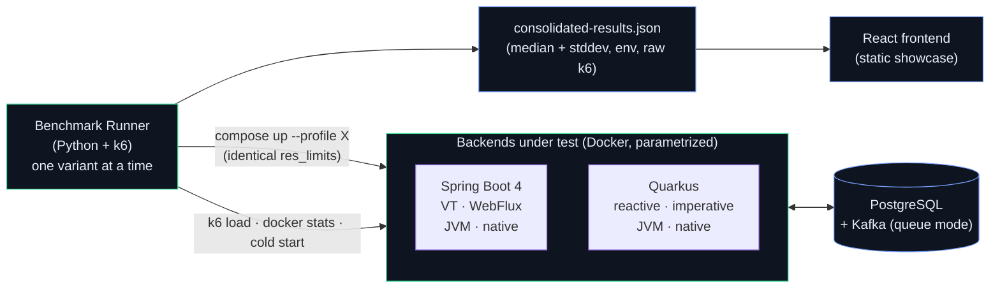
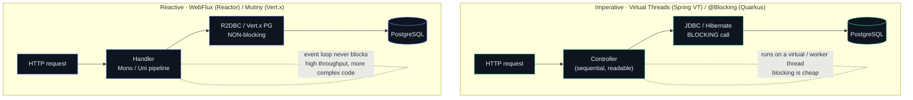
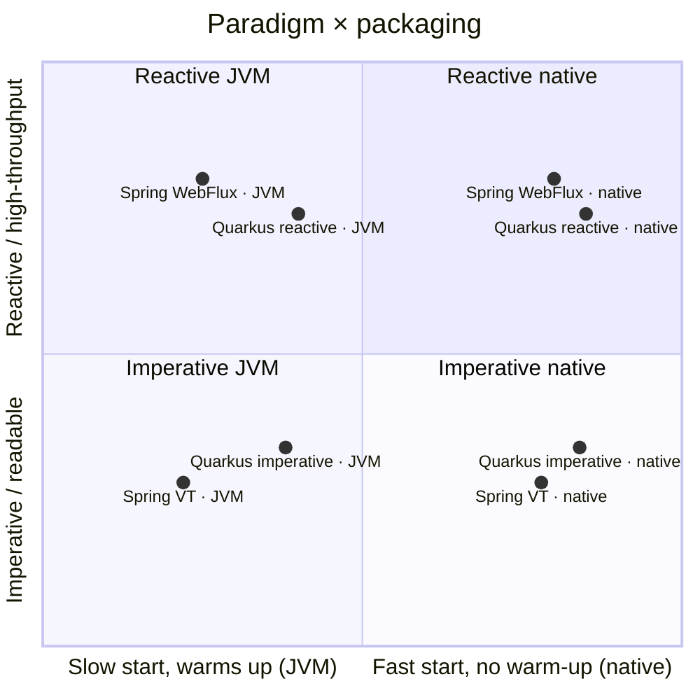

# Architecture

## 1. System — three decoupled layers

Generating trustworthy data is separated from presenting it. Each variant runs in
isolation with dedicated resources; the runner produces an auditable consolidated file;
the frontend only reads it.

- **Evidence** lives in the repo: every variant's source is auditable against the numbers.
- The runner is the **only** piece that touches Docker, k6 and runtime metrics.
- The frontend runs no tests and makes no live calls — it is a vitrine over the JSON.

## 2. Inside a variant — reactive vs imperative

Same API, same domain, same DB. The difference is how a request is carried.

Aggregation is shared, framework-agnostic logic (`io.pulsegrid.agg.Windower`): 10s windows
per `(metricType, region)`, closed by a 1s scheduler, persisted (idempotent UPSERT) and
streamed over SSE. In the Quarkus reactive variant, closed windows are distributed to SSE
subscribers over the **Vert.x EventBus**.

## 3. The design space — concurrency × packaging

The fall-back reading if the quadrant chart does not render:

| | JVM | Native |
|---|-----|--------|
| **Virtual Threads** | Spring VT · JVM | Spring VT · native |
| **WebFlux (Reactor)** | Spring WebFlux · JVM | Spring WebFlux · native ⚠️ |
| **Reactive (Mutiny)** | Quarkus reactive · JVM | Quarkus reactive · native |
| **Imperative (blocking)** | Quarkus imperative · JVM | Quarkus imperative · native |

See [DECISIONS.md](DECISIONS.md) for the design decisions and [RISKS.md](RISKS.md) for the
known native-build risk.
